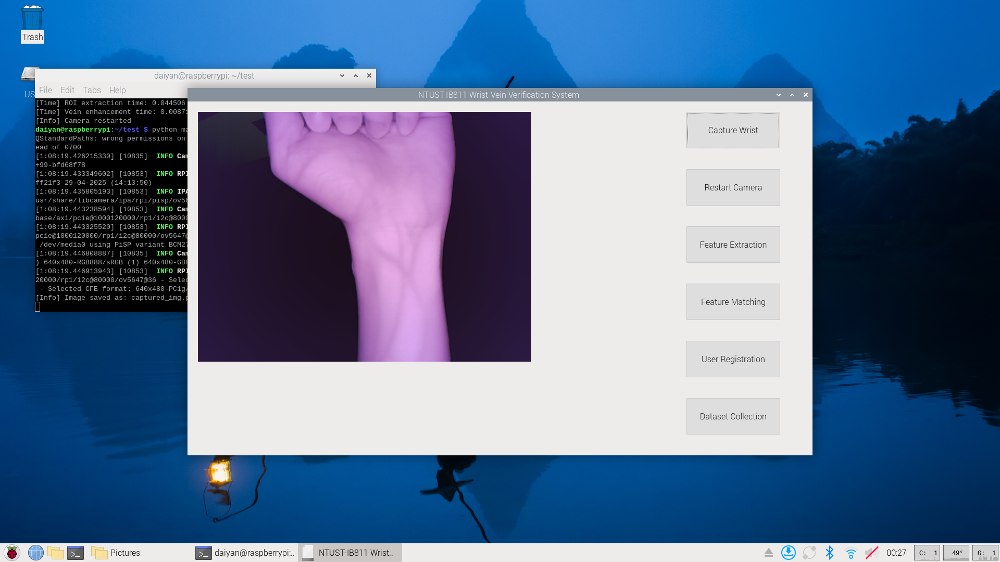
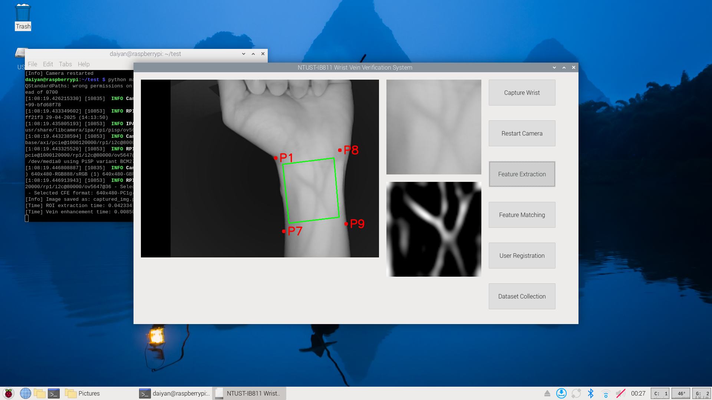
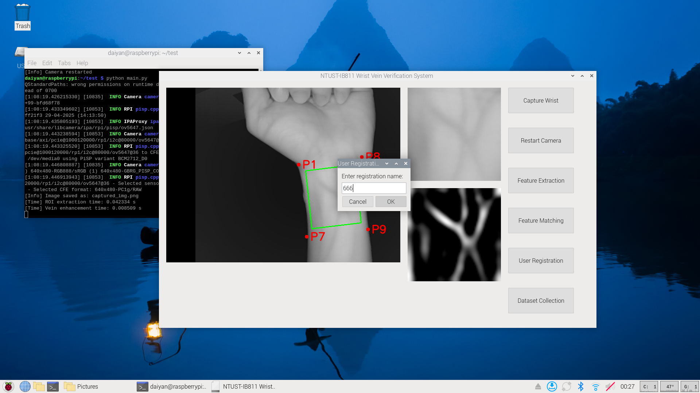
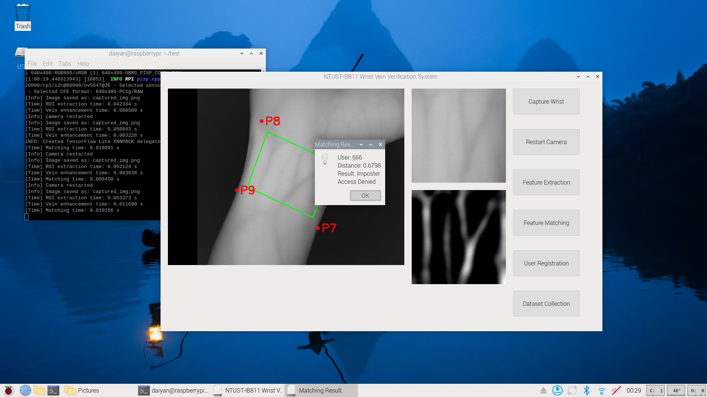
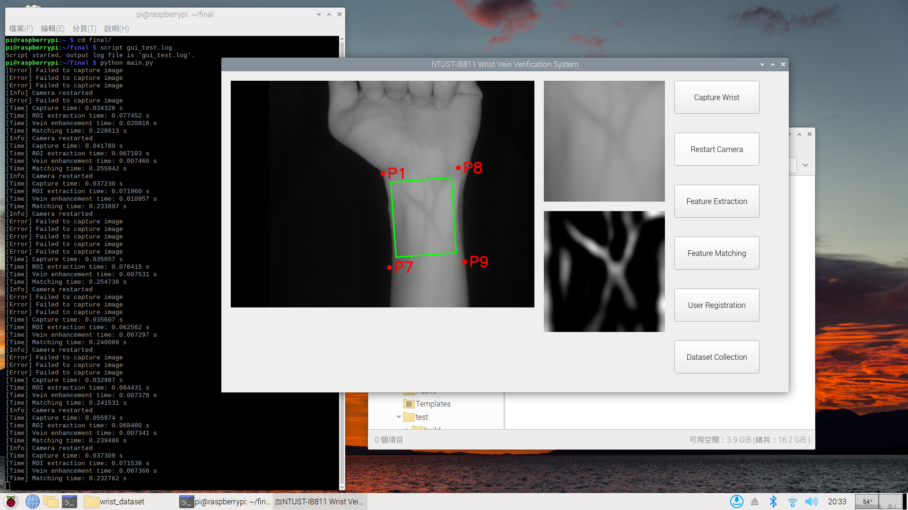

## 2025/12/18 更新
如果您是透過我的碩士論文連結前來，請注意本系統的程式碼與實驗結果已進行以下更新：

使用前想請您注意，儘管有以下更新，這系統仍是個垃圾，各階段演算法皆無法與 SOTA 比較，而且有些地方有重大缺陷，建議去看別人的 Paper...

   - 缺陷 1: `第 3.1 章節`非接觸式手腕感興趣區域（Region of Interest, ROI)提取演算法就是個狗屁，在 3 維空間中拍攝 2 維手腕靜脈影像，受測者手腕可任意呈現手部角度、距離與方向，沒有一致的姿勢，跨次拍攝提取到的靜脈影像不就變形了。

   - 缺陷 2: `第 3.1.8 章節`為何手腕 ROI 演算法能在我們收集的 NTUST-IB811 上達到 120 位受測者（實際為 60 位，但左右手可以視為不同人）平均 0.9775 ± 0.0191 的 SSIM 值 ? 兄弟，仔細看，你會發現，你會訝異，我們的資料集雖然有跨次收集，但都很刻意地讓受測者手腕朝上且維持特定姿勢與距離。真正有挑戰性是受測者能自然地擺放其手腕!!! 但建議還是要有物理對齊的機制（固定式裝置）

本次更新章節與內容：

- `第 3.2 章節`之靜脈特徵增強流程的參數修正：

   原始論文版本在影像增強階段的部分參數設定不正確。經修正後的演算法使皮膚與靜脈之間的對比度更加明顯，噪值更少，重新訓練模型後（[點此連結至增強演算法](https://github.com/Pathfinder1996/biometric-vein-enhancement)），在 FYO 與 PUT 測試集上之相等錯誤率（Equal Error Rate, EER）比論文還低。

- `第 4.2 章節`之靜脈特徵匹配模型子網路架構更新：

   現行系統採用新版的特徵匹配模型（[點此連結至模型架構](https://github.com/Pathfinder1996/lightweight-hybrid-siamese-neural-network)），相較於原論文版本，模型架構有變，計算量已進一步減少，在不犧牲準確率的前提下提升推論效率。

- `第 5.3.1 章節`之手腕靜脈拍攝裝置：

   建議改為固定式裝置的方式拍攝受測者手腕靜脈，即便如此，每個人跨次擺放手腕的位置一定不相同，所以還需套用 ROI 演算法，盡量提取差不多位置的 ROI。（我們的 ROI 演算法依賴幾何輪廓與凸缺陷分析，對手腕旋轉、肌肉狀態等外在條件非常敏感。在非接觸式的情況下只要手腕擺放的角度、距離與方向沒有一致，每次提取到的 ROI 會不同，無法保證跨次拍攝穩定性，所以還需透過固定式等方式加強提取到的 ROI 影像穩健性）

- `第 5.3.4 章節`之樹莓派端延遲大幅下降：

   依據壓縮檔內 `gui_test.log` 的最新結果，目前系統各階段的平均延遲均顯著低於論文所報告的數值。本次更新移除了多項冗餘計算，使整體效能大幅提升。未來版本會以編譯式語言重寫部分模組，進一步降低階段延遲。
  
## NTUST-IB811 Wrist Vein Verification System on Raspberry Pi
This repository provides the open-source implementation of the NTUST-IB811 wrist vein verification system.

The NTUST-IB811 Wrist Vein Dataset, collected using our device, can be downloaded from:

🔗 [https://ieee-dataport.org/documents/ntust-ib811-wrist-vein-dataset](https://ieee-dataport.org/documents/ntust-ib811-wrist-vein-dataset)

This system integrates wrist image acquisition, ROI extraction, vein enhancement, and deep-learning-based feature matching. A lightweight graphical user interface (GUI) is included for easy operation and demonstration.

## Contents
- `gui_test.log` - Console output log showing processing latency for each system stage.
- `main.py` - GUI for the NTUST-IB811 wrist vein verification system.
- `vein_enhance.py` - Functions for vein enhancement.
- `wrist_roi.py` - Functions for wrist ROI extraction.
- `requirements.txt` - Python 3.9.2 dependency list used on Raspberry Pi.
- `Ours_model_fold_3.tflite` - The best-performing model for feature matching.

## Development on Personal Computer
The system modules were first developed and validated on a PC
- ROI Extraction: [https://github.com/Pathfinder1996/wrist-roi-extraction](https://github.com/Pathfinder1996/wrist-roi-extraction)
- Vein Enhancement: [https://github.com/Pathfinder1996/biometric-vein-enhancement](https://github.com/Pathfinder1996/biometric-vein-enhancement)
- Lightweight Siamese Network Feature Matching Model (Training on PC): [https://github.com/Pathfinder1996/lightweight-hybrid-siamese-neural-network](https://github.com/Pathfinder1996/lightweight-hybrid-siamese-neural-network)

## System Workflow
- The verification pipeline consists of four stages:
1. Capture the wrist vein image
2. Extract the ROI
3. Enhance the vein image
4. Load the trained model for feature matching
   - Users may register or authenticate
   - For authentication, the system extracts the user’s vein features and compares them with the claimed identity stored in the database

- System Flowchart:


## Example Results (Click the thumbnails to enlarge)
| Capture Wrist | Feature Extraction (ROI + Vein Enhancement) | User Registration | Feature Matching (Same wrist used for authentication → Accepted) | Execution Time Overview |
|-------------|-----------------|-----------------|-----------------|-----------------|
|  |  | | | |

This demo showcases the full workflow of our wrist vein verification system on Raspberry Pi.

## Raspberry Pi OS Version
```
Debian 12 Bookworm
```

## How to Use
Install the required Python 3.9.2 packages:
```
pip install -r requirements.txt
```
Note: Some packages listed in requirements.txt cannot be installed directly via pip on Raspberry Pi.
For these modules, you must manually download the specified version (source archive or wheel file) from the official website or GitHub release page and install them locally.

Update all file paths inside `main.py` according to your system, then run the GUI:
```
python main.py
```
