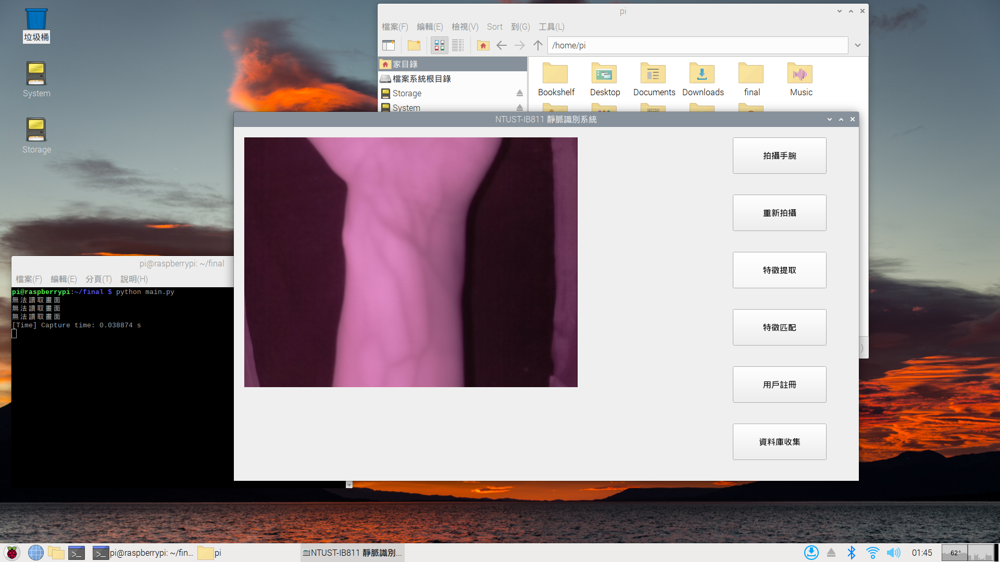
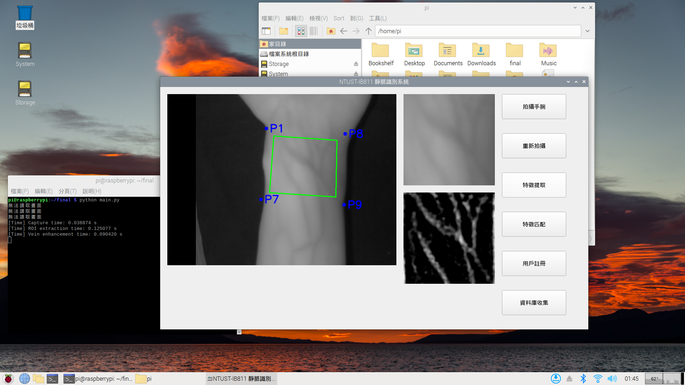
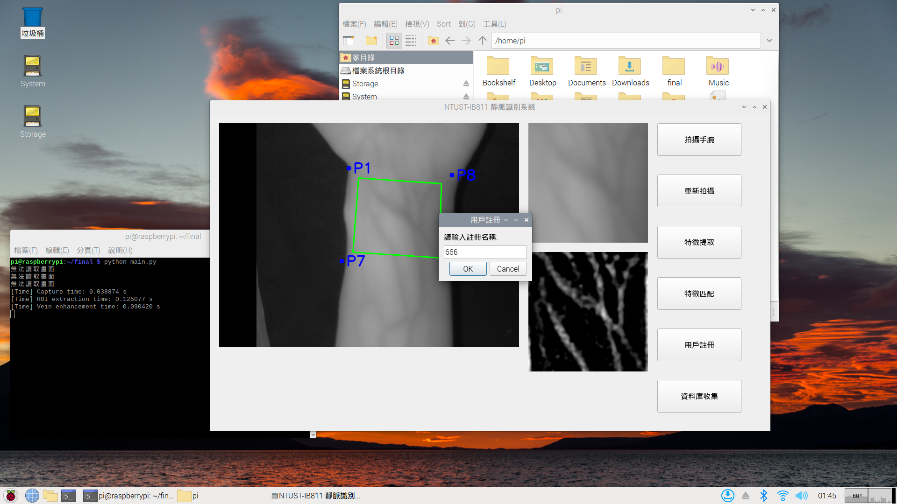
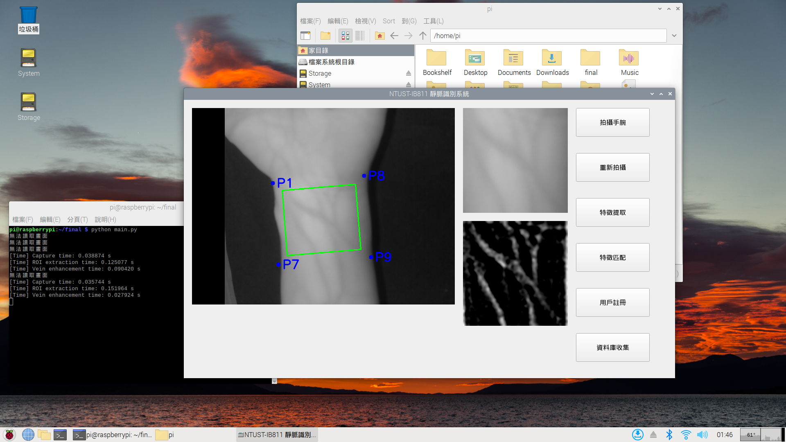
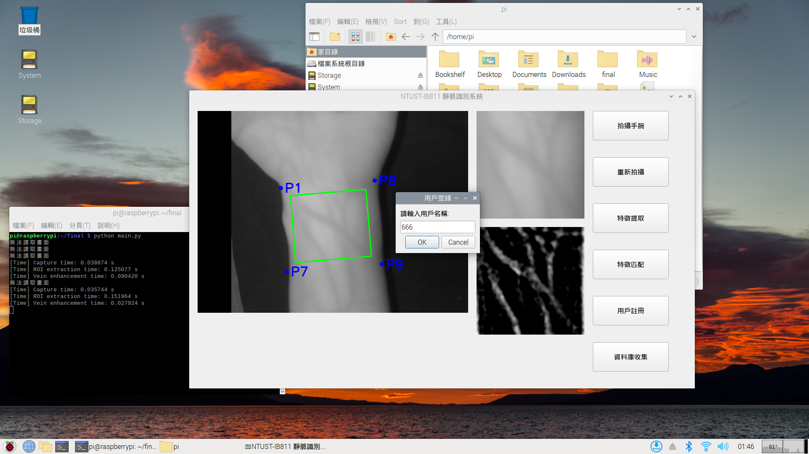
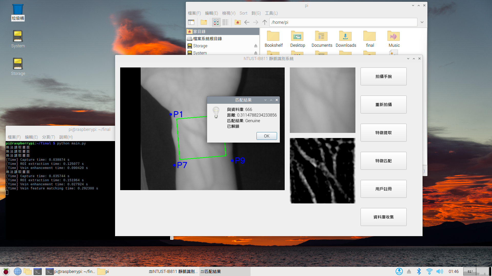

## 📝 NTUST-IB811 手腕靜脈辨識系統
此專題為我的碩士論文手腕靜脈辨識系統

使用 Python 將手腕影像拍攝、手腕感興趣區域(ROI)提取、靜脈特徵增強與靜脈特徵匹配模組整合至樹莓派，並設計一個陽春的圖形用使用者介面(GUI)方便操作觀看整個辨識流程。

手腕影像拍攝裝置、系統辨識流程與每次辨識平均耗時在我的論文第 58-66 頁。[請點此到我的論文連結並到電子全文下載論文](https://etheses.lib.ntust.edu.tw/thesis/detail/2b733280676d7c87e0445313c40a9b74/?seq=2#)

### 📁 壓縮檔內容
- `ntust_ib811_wrist_vein_database` - 本研究裝置所收集之 NTUST-IB811 手腕靜脈資料庫，共 2400 張左右手腕靜脈影像。
- `ntust_ib811_database_introduction.pdf` - NTUST-IB811 手腕靜脈資料庫影像命名方式簡介。
- `main.py` - NTUST-IB811 手腕靜脈辨識系統 GUI。
- `vein_enhance.py` - 靜脈特徵增強時用到的函式。
- `wrist_roi.py` - 手腕感興趣區域提取時用到的函式。
- `requirements.txt` - Python3.9.2 用到的函式庫及其版本。
- `Ours_model_fold_3.tflite` - 本研究最佳模型(特徵匹配階段載入用)。

## 🔗 個人電腦上開發
以下為辨識系統各階段程式碼，先在個人電腦上開發並測試，後續整合至樹梅派運行。
- 手腕感興趣區域(ROI)提取: [請點此連結到ROI演算法流程](https://github.com/Pathfinder1996/wrist-roi-extraction)
- 靜脈特徵增強: [請點此連結到靜脈特徵增強演算法流程](https://github.com/Pathfinder1996/biometric-vein-enhancement)
- 靜脈特徵匹配之輕量化深度學習模型實現(請先在個人電腦上建模): [請點此連結到訓練靜脈特徵匹配模型](https://github.com/Pathfinder1996/lightweight-hybrid-siamese-neural-network)

## 🔧 系統辨識流程圖
- 系統辨識流程分為四個階段:
1. 拍攝手腕靜脈影像
2. 手腕感興趣區域影像提取
3. 手腕靜脈特徵增強
4. 載入訓練好的模型進行靜脈特徵匹配(此階段會先問訪問者是要註冊還是訪問本系統，若選擇訪問會提取其靜脈特徵，並詢問訪問者是誰，接著載入其宣稱之用戶靜脈特徵影像進行匹配，判斷訪問者是否有權訪問本系統)

- 系統辨識流程圖如下圖:


## 📊 樹莓派實際運行畫面 (點擊縮圖可放大)
<table border="1" cellspacing="0" cellpadding="6">
  <tr>
    <th>描述</th>
    <th>拍攝左手腕靜脈影像(拍攝手腕按鈕)</th>
    <th>提取感興趣區域與靜脈特徵增強(特徵提取按鈕)</th>
    <th>用戶註冊(用戶註冊按鈕)</th>
    <th>用戶資料輸入</th>
  </tr>
  <tr>
    <td>實際運行畫面</td>
    <td></td>
    <td></td>
    <td></td>
    <td></td>
  </tr>
</table>

<table border="1" cellspacing="0" cellpadding="6">
  <tr>
    <th>描述</th>
    <th>影像保存到資料庫</th>
    <th>再次拍攝左手腕靜脈影像</th>
    <th>訪問系統(特徵匹配按鈕)</th>
    <th>判斷為系統用戶，允許訪問</th>
  </tr>
  <tr>
    <td>實際訪問測試</td>
    <td></td>
    <td></td>
    <td></td>
    <td></td>
  </tr>
</table>

## 🔧 本研究樹莓派 OS 版本
```
Debian 12 Bookworm
```

## 🚀 如何使用
請輸入以下指令建置 Python3.9.2 環境用到的函式庫及其版本(有的沒辦法直接 pip 安裝，請自行去官網載 `requirements.txt` 內指定版本壓縮檔安裝):
```
pip install -r requirements.txt
```
將 `main.py` 內的所有資料存放路徑替換為您指定的之後，輸入以下指令執行程式運行 NTUST-IB811 手腕靜脈辨識系統 GUI:
```
python main.py
```
